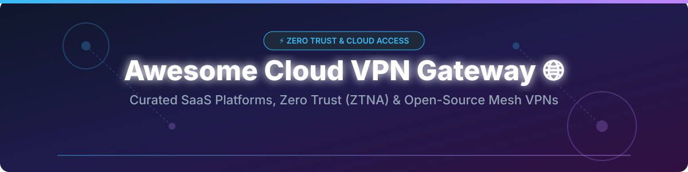
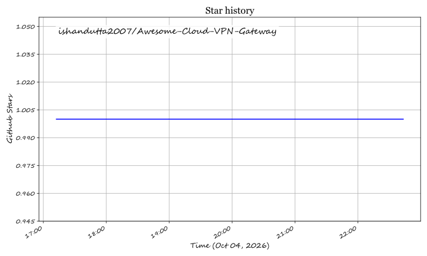

  

# 🚀 Awesome Cloud VPN Gateway 🛡️

  
  
  
  
  
  

> **Curated list of top SaaS products, Zero Trust Network Access (ZTNA) solutions, and open-source Cloud VPN gateways.**

**Last updated:** October 2026

---

This repository tracks notable **SaaS platforms** and **open-source projects** for **Cloud VPN Gateways**, **Zero Trust Network Access (ZTNA)**, and **Mesh VPNs**. These security tools assist network engineers, DevOps, and infrastructure teams to provide secure remote access to private cloud resources, replacing legacy hardware VPN concentrators with modern, identity-aware, least-privilege connectivity.

---

## 📖 Table of Contents

- [☁️ SaaS/Hosted Platforms](#️-saashosted-platforms)
- [🔓 Open-Source GitHub Projects](#-open-source-github-projects)
- [☕ Support & Community](#-support--community)
- [🤝 How to Contribute](#-how-to-contribute)
- [⚠️ Disclaimer](#️-disclaimer)
- [⭐ Star History](#-star-history)

---

## ☁️ SaaS/Hosted Platforms

> **📊 Market Context**: The global Zero Trust Network Access (ZTNA) and Cloud VPN market is estimated at **~$2.5B in 2026**, growing toward **~$8B by 2031** at a **~26% CAGR**. The sector is **moderately fragmented** — Cloudflare Access and Tailscale compete on developer experience, while Twingate and Zscaler Private Access target enterprise least-privilege access. No single vendor holds a winner-take-all position; enterprises typically deploy multi-vendor hybrid stacks.

*Platforms sorted by company size/revenue in descending order.*

| Platform | Description | Pricing (Starting Tier) | Free Tier Limits | Company Size (Revenue / Valuation) |
|---|---|---|---|---|
| **[AWS Client VPN](https://aws.amazon.com/vpn/client-vpn/)** | Managed client-based OpenVPN gateway service for AWS VPCs and on-premises networks. | **$0.10/hour per endpoint** + **$0.05/hour per connection** | **$100–$200 free credits** for new accounts (30-day limit) | **~$638B revenue (Amazon FY2025)** |
| **[Google Cloud VPN](https://cloud.google.com/network-connectivity/docs/vpn)** | Managed IPsec VPN for securely connecting on-premises networks to GCP VPCs. | **$0.05/hour per VPN tunnel** + egress data transfer | **$300 free trial credits** (valid for 90 days) | **~$350B revenue (Alphabet FY2025)** |
| **[Azure VPN Gateway](https://azure.microsoft.com/en-us/products/vpn-gateway/)** | Managed VPN gateway for site-to-site and point-to-site connectivity into Azure VNets. | **$0.04/hour** (Basic Gateway) or **$0.19/hour** (VpnGw1) | **$200 free trial credit** (30-day limit) + 12 months free services | **~$281B revenue (Microsoft FY2025)** |
| **[Cisco AnyConnect](https://www.cisco.com/)** | Enterprise remote access VPN client integrated into Cisco Secure Client ecosystem. | **$50/user/year** (Essentials starting tier) | **45-day free evaluation** (Enterprise demo required) | **~$63B revenue (Cisco FY2025)** |
| **[Fortinet FortiClient](https://www.fortinet.com/)** | Endpoint protection & fabric agent with SSL/IPsec VPN client capability. | **$18/user/year** (ZTNA & VPN license tier) | **Free tier**: Standalone FortiClient VPN client is **100% free** for basic VPN tunnels | **~$5.5B revenue (Fortinet FY2025)** |
| **[Perimeter 81](https://www.perimeter81.com/)** | Converged network security and ZTNA platform (acquired by Check Point). | **$8/user/month** + $40/month gateway fee | **14-day free trial** with full feature access | **Part of Check Point (~$2.5B revenue)** |
| **[Cloudflare Access](https://www.cloudflare.com/zero-trust/products/access/)** | Identity-aware proxy providing clientless ZTNA access to web, SSH, and RDP. | **$7/user/month** (Pay-as-you-go Plan) | **Permanently free** for **up to 50 users** (includes WARP & cloudflared) | **~$2.17B revenue (Cloudflare FY2025)** |
| **[NordLayer](https://nordlayer.com/)** | Business VPN with Zero Trust network access control and dedicated IP gateways. | **$8/user/month** (Essential Plan, billed annually) | **14-day money-back guarantee / 7-day trial** | **Part of Nord Security (~$3B valuation)** |
| **[Tailscale](https://tailscale.com/)** | Zero-config WireGuard mesh VPN with SSO/IdP authentication and MagicDNS. | **$6/user/month** (Starter Plan, billed annually) | **Permanently free Personal plan**: **up to 6 users** & unlimited devices | **Private (~$100M+ ARR est.)** |
| **[OpenVPN Cloud](https://openvpn.net/)** | Cloud-delivered ZTNA and managed OpenVPN CloudConnexa network. | **$7/connector/month** (or $5/device/month) | **Permanently free** for **up to 3 connected devices** | **Private (~$50M+ revenue est.)** |
| **[Twingate](https://www.twingate.com/)** | Next-gen ZTNA solution replacing corporate VPNs with granular access control. | **$5/user/month** (Teams Plan, billed annually) | **Permanently free Starter plan**: **5 users**, 1 admin, 10 resources | **Private (~$42M raised)** |

---

## 🔓 Open-Source GitHub Projects

> **💡 Open-Source Advantage**: Modern open-source mesh VPNs and Zero Trust controllers (like **WireGuard**, **Headscale**, and **NetBird**) offer enterprise-grade cryptography, peer-to-peer speeds, and complete data sovereignty without per-user licensing fees.

*Sorted by GitHub Stars_Count (descending). Badges link directly to stargazers pages.*

| Repo | Description | GitHub_Stars |
|---|---|---|
| **[Headscale](https://github.com/juanfont/headscale)** — An open-source, self-hosted implementation of the Tailscale control server. BSD-3-Clause. |  | ~25,000 |
| **[Tailscale](https://github.com/tailscale/tailscale)** — WireGuard-based mesh VPN client and node agent for secure private networking. BSD-3-Clause. |  | ~20,000 |
| **[Nebula](https://github.com/slackhq/nebula)** — A scalable overlay networking tool with a focus on performance, security, and simplicity by Slack. MIT. |  | ~18,400 |
| **[NetBird](https://github.com/netbirdio/netbird)** — Open-source WireGuard-based mesh VPN with automated peer discovery and SSO/MFA integration. BSD-3-Clause. |  | ~15,000 |
| **[ZeroTier](https://github.com/zerotier/ZeroTierOne)** — Smart Ethernet switches for virtual networks; creates secure P2P networks across devices. BSL-1.1. |  | ~14,000 |
| **[OpenVPN](https://github.com/OpenVPN/openvpn)** — The battle-tested, classic open-source SSL VPN protocol software. GPL-2.0. |  | ~10,000 |
| **[Firezone](https://github.com/firezone/firezone)** — Open-source WireGuard-based Zero Trust access platform and remote access gateway. Apache-2.0. |  | ~9,100 |
| **[WireGuard](https://github.com/WireGuard/wireguard-linux)** — Extremely simple yet fast and modern VPN that utilizes state-of-the-art cryptography. GPL-2.0. |  | ~5,000 |
| **[Pomerium](https://github.com/pomerium/pomerium)** — Identity-aware proxy for authentication and authorization to internal applications. Apache-2.0. |  | ~4,500 |
| **[OpenConnect](https://github.com/openconnect/openconnect)** — Open-source multi-protocol VPN client supporting Cisco AnyConnect & GlobalProtect. LGPL-2.1. |  | ~3,500 |

---

## ☕ Support & Community

Thank you for visiting this repository! If you find this curated list helpful for evaluating Cloud VPN Gateways and Zero Trust Access platforms, please consider supporting the project:

- ⭐ **Star** this repository to help others discover it.
- 🔀 **Fork** and contribute new tools or update existing entries.
- 📢 **Share** with network engineers, DevOps professionals, and security practitioners.
- ☕ **Buy me a coffee**: If you'd like to support ongoing updates and maintenance, consider sponsoring via [GitHub Sponsors](https://github.com/sponsors/ishandutta2007).

---

## 🤝 How to Contribute

1. Fork the repository.
2. Edit `README.md` following the table schema.
3. Submit a Pull Request with details regarding pricing, free limits, or Stars_Counts.

---

## ⚠️ Disclaimer

- This is a community-curated collection for informational and educational purposes.
- All product names, logos, and brands are property of their respective owners.

---

## ⭐ Star History

## ⭐ Star History

<a href="https://star-history.com/#ishandutta2007/Awesome-Cloud-VPN-Gateway&Timeline" align="center">
  <picture>
    <source media="(prefers-color-scheme: dark)" srcset="assets/ishandutta2007_Awesome-Cloud-VPN-Gateway_growth.svg">
    
  </picture>
</a>
